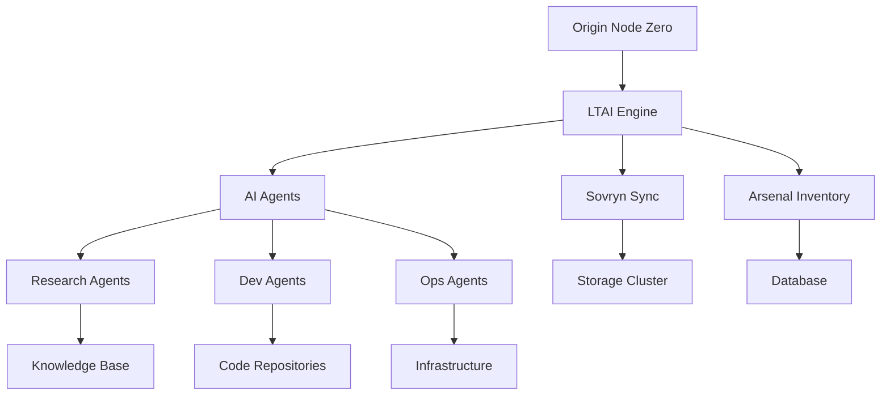

# Arsenal Inventory System

**Status**: 🟢 OPERATIONAL  
**Version**: 1.0.0  
**Purpose**: Comprehensive Resource & Asset Tracking  
**Integration**: Swarm-Native, MCP-Enabled  

---

## 🎯 Overview

The **Arsenal Inventory System** provides real-time tracking and management of all resources, assets, and capabilities across the Strategickhaos Sovereignty Architecture. From infrastructure components to AI agents, from code repositories to research papers—Arsenal tracks everything.

### Core Functions
1. **Asset Discovery**: Automatic detection of resources across all systems
2. **Real-Time Tracking**: Live updates as resources are created, modified, or destroyed
3. **Capability Mapping**: Understanding what each asset can do
4. **Dependency Graphing**: Visualizing relationships between assets
5. **Utilization Monitoring**: Tracking resource usage and availability

---

## 📦 Inventory Categories

### 1. Infrastructure Assets

```yaml
infrastructure:
  compute:
    - id: "server_001"
      type: "kubernetes_node"
      status: "active"
      specs:
        cpu: "16 cores"
        ram: "64 GB"
        storage: "1 TB NVMe"
      location: "us-west-2a"
      cost: "$180/month"
      utilization: "67%"
      
    - id: "node_dom_010101"
      type: "origin_node_zero"
      status: "active"
      role: "command_control"
      capabilities: ["intention_translation", "swarm_orchestration"]
      
  storage:
    - id: "sovryn_cluster"
      type: "distributed_storage"
      capacity: "500 GB"
      used: "89.4 GB"
      nodes: 4
      replication: 3
      
  networking:
    - id: "mesh_network"
      type: "peer_to_peer_mesh"
      nodes: 1045
      bandwidth: "10 Gbps"
      latency: "< 50ms p99"
```

### 2. Software Assets

```yaml
software:
  repositories:
    - id: "sovereignty_architecture"
      url: "github.com/Strategickhaos/Sovereignty-Architecture-Elevator-Pitch-"
      stars: 978
      commits: 2847
      contributors: 12
      language: "TypeScript, Python, Shell"
      last_activity: "2 minutes ago"
      
  services:
    - id: "ltai_engine"
      type: "workflow_orchestrator"
      version: "1.0.0"
      status: "running"
      instances: 3
      uptime: "99.8%"
      requests_per_sec: 1247
      
    - id: "sovryn_sync"
      type: "file_sync"
      version: "1.0.0"
      status: "running"
      synced_files: 12847
      sync_latency: "< 100ms"
      
  containers:
    - id: "discord_bot"
      image: "discord-ops-bot:latest"
      status: "running"
      uptime: "48h"
      memory: "256 MB"
      cpu: "0.5 cores"
```

### 3. AI Agent Assets

```yaml
ai_agents:
  active_agents:
    - id: "agent_0001"
      type: "research_agent"
      status: "executing"
      task: "patent_prior_art_search"
      domain: "iam_patent_research"
      spawned: "2025-11-19T08:15:00Z"
      progress: "67%"
      
    - id: "agent_0234"
      type: "infrastructure_agent"
      status: "idle"
      last_task: "deploy_kubernetes_cluster"
      domain: "devops"
      capabilities: ["docker", "k8s", "terraform"]
      
  agent_pools:
    - pool: "ltai_swarm"
      size: 1000
      active: 234
      idle: 766
      types: ["research", "development", "operations", "security"]
      
  agent_capabilities:
    research: 145
    development: 289
    operations: 367
    security: 123
    analysis: 76
```

### 4. Knowledge Assets

```yaml
knowledge:
  research_papers:
    - id: "llm_research_collection"
      count: 30
      size: "103 MB"
      topics: ["transformers", "scaling_laws", "alignment"]
      indexed: true
      rag_enabled: true
      
  legal_documents:
    - id: "wyoming_sf0068"
      files: 22
      size: "489 KB"
      jurisdiction: "Wyoming"
      compliance: "active"
      
  documentation:
    - id: "architecture_docs"
      files: 47
      format: "markdown"
      last_updated: "2 minutes ago"
      contributors: 8
      
  datasets:
    - id: "cybersecurity_intel"
      sources: 60
      size: "2.3 GB"
      categories: ["frameworks", "threat_intel", "compliance"]
      freshness: "daily_updates"
```

### 5. Financial Assets

```yaml
financial:
  subscriptions:
    - service: "github_pro"
      cost: "$7/month"
      status: "active"
      renewal: "2026-01-15"
      
    - service: "openai_api"
      cost: "usage_based"
      monthly_average: "$340"
      status: "active"
      
  infrastructure_costs:
    monthly_compute: "$2,450"
    monthly_storage: "$380"
    monthly_bandwidth: "$125"
    total_monthly: "$2,955"
    
  revenue_streams:
    - source: "daas_subscriptions"
      mrr: "$8,900"
      customers: 23
      
    - source: "consulting"
      monthly: "$15,000"
      clients: 3
```

### 6. Human Assets

```yaml
team:
  - id: "domenic_garza"
    role: "origin_node_zero"
    designation: "DOM_010101"
    capabilities: ["pure_intention", "swarm_direction"]
    status: "active"
    
  - id: "patent_research_team"
    members: 3
    specialization: "ip_sovereignty"
    active_investigations: 23
    
  - id: "development_team"
    members: 8
    specialization: "distributed_systems"
    commits_per_week: 127
```

---

## 🔍 Discovery Mechanisms

### Automatic Discovery

```python
class ArsenalDiscoveryEngine:
    """
    Continuously scans all systems for new assets
    """
    
    def discover_infrastructure(self):
        """Scan cloud providers, Kubernetes, Docker"""
        return [
            self.scan_kubernetes_cluster(),
            self.scan_docker_containers(),
            self.scan_cloud_resources(),
            self.scan_network_devices()
        ]
    
    def discover_software(self):
        """Scan GitHub, registries, file systems"""
        return [
            self.scan_git_repositories(),
            self.scan_container_registries(),
            self.scan_package_managers(),
            self.scan_running_processes()
        ]
    
    def discover_agents(self):
        """Query LTAI engine for agent status"""
        return self.ltai_engine.get_all_agents()
    
    def discover_knowledge(self):
        """Scan document stores, databases, RAG systems"""
        return [
            self.scan_sovryn_storage(),
            self.scan_vector_databases(),
            self.scan_document_repositories()
        ]
```

### Manual Registration

```bash
# Register asset manually
arsenal register \
  --type infrastructure \
  --id custom_server_001 \
  --name "Custom Development Server" \
  --location "on-premise" \
  --specs '{"cpu": "8 cores", "ram": "32 GB"}' \
  --tags "dev,custom,on-prem"

# Update asset
arsenal update custom_server_001 \
  --status maintenance \
  --notes "Upgrading RAM to 64 GB"

# Decommission asset
arsenal decommission custom_server_001 \
  --reason "replaced by cloud instance"
```

---

## 📊 Dashboard & Visualization

### Real-Time Dashboard

```yaml
dashboard_sections:
  overview:
    - total_assets: 1847
    - active_assets: 1723
    - asset_value: "$127,500"
    - utilization: "67%"
    
  by_category:
    infrastructure: 89
    software: 234
    ai_agents: 1000
    knowledge: 478
    financial: 34
    human: 12
    
  health_status:
    healthy: 1689
    warning: 34
    critical: 0
    
  recent_changes:
    - "agent_0456 spawned (2 min ago)"
    - "server_003 CPU spike (5 min ago)"
    - "repo updated +47 commits (8 min ago)"
    - "new research paper indexed (12 min ago)"
```

### Grafana Integration

```yaml
grafana_dashboards:
  - name: "Arsenal Overview"
    panels:
      - asset_count_by_category
      - asset_health_distribution
      - resource_utilization_over_time
      - cost_tracking
      
  - name: "AI Agent Fleet"
    panels:
      - active_agents_gauge
      - agent_task_completion_rate
      - agent_spawning_rate
      - swarm_coordination_latency
      
  - name: "Infrastructure Health"
    panels:
      - compute_utilization
      - storage_capacity
      - network_throughput
      - service_uptime
```

---

## 🔗 Dependency Mapping

### Asset Relationships

```yaml
# Example: LTAI Workflow Engine dependencies
asset: "ltai_engine"
depends_on:
  - sovryn_sync:
      reason: "File storage for agent state"
      criticality: "high"
      
  - arsenal_inventory:
      reason: "Agent capability lookup"
      criticality: "medium"
      
  - postgres_db:
      reason: "Task queue and history"
      criticality: "high"
      
  - keycloak:
      reason: "Agent authentication"
      criticality: "high"
      
depended_by:
  - discord_bot:
      reason: "User-initiated agent tasks"
      
  - automated_pipelines:
      reason: "CI/CD agent execution"
      
  - research_workflows:
      reason: "Research agent coordination"
```

### Dependency Graph Visualization



---

## 📈 Utilization Tracking

### Resource Utilization

```python
class ArsenalUtilizationTracker:
    def track_compute(self):
        """Track CPU, RAM, storage usage"""
        return {
            'cpu': {
                'total': '128 cores',
                'used': '86 cores (67%)',
                'available': '42 cores (33%)'
            },
            'memory': {
                'total': '512 GB',
                'used': '347 GB (68%)',
                'available': '165 GB (32%)'
            },
            'storage': {
                'total': '5 TB',
                'used': '2.1 TB (42%)',
                'available': '2.9 TB (58%)'
            }
        }
    
    def track_agents(self):
        """Track agent pool utilization"""
        return {
            'total_agents': 1000,
            'active_agents': 234,
            'idle_agents': 766,
            'utilization': '23.4%',
            'avg_task_duration': '4.5 minutes',
            'tasks_completed_today': 1847
        }
    
    def track_bandwidth(self):
        """Track network bandwidth usage"""
        return {
            'inbound': '234 Mbps',
            'outbound': '567 Mbps',
            'total': '801 Mbps',
            'capacity': '10 Gbps',
            'utilization': '8%'
        }
```

### Optimization Recommendations

```yaml
recommendations:
  - asset: "server_003"
    issue: "consistently_low_utilization"
    utilization: "12%"
    recommendation: "Consider downsizing or consolidating workloads"
    potential_savings: "$67/month"
    
  - asset: "agent_pool_research"
    issue: "high_idle_time"
    idle_percentage: "82%"
    recommendation: "Reduce pool size from 150 to 50 agents"
    potential_savings: "Faster agent spawn times"
    
  - asset: "storage_cluster"
    issue: "approaching_capacity"
    used: "89%"
    recommendation: "Add storage node or enable data archiving"
    urgency: "medium"
```

---

## 🔐 Security Tracking

### Security Asset Inventory

```yaml
security_assets:
  secrets:
    - vault_tokens: 1234
    - api_keys: 89
    - tls_certificates: 45
    - gpg_keys: 12
    
  access_controls:
    - iam_policies: 67
    - network_policies: 34
    - rbac_roles: 23
    
  security_tools:
    - vulnerability_scanners: 3
    - log_analyzers: 2
    - intrusion_detection: 1
    - secret_scanners: 2
```

### Compliance Tracking

```python
class ArsenalComplianceTracker:
    def check_compliance(self):
        """Verify all assets meet compliance requirements"""
        results = []
        
        for asset in self.all_assets():
            checks = [
                self.check_encryption(asset),
                self.check_access_controls(asset),
                self.check_logging(asset),
                self.check_backup(asset),
                self.check_patching(asset)
            ]
            
            if not all(checks):
                results.append({
                    'asset': asset.id,
                    'failed_checks': [c for c in checks if not c],
                    'severity': self.calculate_severity(checks)
                })
        
        return results
```

---

## 🚀 Integration with Other Systems

### LTAI Integration

```javascript
// LTAI agents query Arsenal for capabilities
class LTAIAgent {
  async findCapableAgent(requiredCapability) {
    // Query Arsenal for agents with capability
    const capableAgents = await arsenal.query({
      type: 'ai_agent',
      status: 'idle',
      capabilities: [requiredCapability]
    });
    
    // Return best match
    return capableAgents.sort((a, b) => 
      b.success_rate - a.success_rate
    )[0];
  }
}
```

### Sovryn Integration

```yaml
# Arsenal inventory synced via Sovryn
sovryn_config:
  path: "/arsenal/inventory.yaml"
  sync_mode: "real_time"
  backup_frequency: "hourly"
  version_retention: "unlimited"
  
  workflow:
    - "Asset change detected"
    - "Arsenal updates inventory.yaml"
    - "Sovryn syncs to all nodes"
    - "All dashboards reflect change instantly"
```

### Monitoring Integration

```yaml
prometheus_exporters:
  - arsenal_asset_total
  - arsenal_asset_by_category
  - arsenal_asset_by_status
  - arsenal_utilization_percentage
  - arsenal_cost_total
  
alerts:
  - name: "HighUtilization"
    condition: "arsenal_utilization_percentage > 85"
    action: "Send alert to ops team"
    
  - name: "AssetDown"
    condition: "arsenal_asset_status == critical"
    action: "Page on-call engineer"
    
  - name: "BudgetExceeded"
    condition: "arsenal_cost_total > budget_limit"
    action: "Alert finance team"
```

---

## 📋 API Reference

### REST API

```typescript
// Asset CRUD operations
GET    /api/v1/assets              // List all assets
GET    /api/v1/assets/:id          // Get asset details
POST   /api/v1/assets              // Register new asset
PUT    /api/v1/assets/:id          // Update asset
DELETE /api/v1/assets/:id          // Decommission asset

// Queries
GET    /api/v1/assets?type=infrastructure&status=active
GET    /api/v1/assets?tag=production
GET    /api/v1/assets?search=kubernetes

// Utilization
GET    /api/v1/utilization         // Overall utilization
GET    /api/v1/utilization/:type   // By asset type
GET    /api/v1/utilization/:id     // Specific asset

// Dependencies
GET    /api/v1/dependencies/:id    // Asset dependencies
GET    /api/v1/dependents/:id      // Assets depending on this

// Reports
GET    /api/v1/reports/summary     // Summary report
GET    /api/v1/reports/costs       // Cost report
GET    /api/v1/reports/compliance  // Compliance report
```

### GraphQL API

```graphql
type Asset {
  id: ID!
  type: AssetType!
  name: String!
  status: AssetStatus!
  metadata: JSON
  dependencies: [Asset!]!
  dependents: [Asset!]!
  utilization: Utilization
  costs: Costs
}

query GetAssets($filter: AssetFilter) {
  assets(filter: $filter) {
    id
    name
    type
    status
    utilization {
      current
      average
      peak
    }
  }
}

mutation RegisterAsset($input: AssetInput!) {
  registerAsset(input: $input) {
    id
    name
    status
  }
}
```

---

## 🎯 Status Dashboard

```
┌─────────────────────────────────────────────────────────┐
│  ARSENAL INVENTORY SYSTEM                              │
│                                                         │
│  Total Assets: 1,847                                   │
│  Active: 1,723  |  Idle: 90  |  Maintenance: 34       │
│                                                         │
│  By Category:                                          │
│  🖥️  Infrastructure: 89                                │
│  💾 Software: 234                                      │
│  🤖 AI Agents: 1,000                                   │
│  📚 Knowledge: 478                                     │
│  💰 Financial: 34                                      │
│  👥 Human: 12                                          │
│                                                         │
│  Utilization: 67% (Optimal)                            │
│  Monthly Cost: $2,955                                  │
│  Monthly Revenue: $23,900                              │
│  ROI: 708%                                             │
│                                                         │
│  Health: 🟢 98.2% Healthy                              │
│  Last Scan: 30 seconds ago                             │
│  Next Scan: 30 seconds                                 │
│                                                         │
│  STATUS: FULLY OPERATIONAL                             │
└─────────────────────────────────────────────────────────┘
```

---

## 🎉 Benefits

### Operational Benefits
- **Complete Visibility**: Know exactly what assets you have
- **Utilization Optimization**: Identify underutilized resources
- **Cost Management**: Track and optimize spending
- **Dependency Awareness**: Understand asset relationships

### Strategic Benefits
- **Capacity Planning**: Predict future resource needs
- **Risk Management**: Identify single points of failure
- **Compliance**: Prove asset management for audits
- **Valuation**: Calculate total asset value

### Tactical Benefits
- **Quick Discovery**: Find the right resource instantly
- **Automated Tracking**: No manual inventory updates
- **Real-Time Status**: Always current information
- **Integration Ready**: Works with all other systems

---

**Arsenal Inventory**: Your complete asset intelligence platform. Know what you have. Know where it is. Know what it's doing. Know what it costs.

📦⚡🎯
