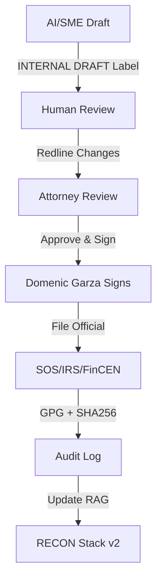

# COMPREHENSIVE RESEARCH & GOVERNANCE DEPLOYMENT COMPLETE ✅

**Date**: November 16, 2025  
**Operator**: Domenic Garza (Node 137)  
**Status**: OPERATIONAL & UPL-SAFE  

---

## 🎯 **MISSION ACCOMPLISHED**

### **Research Collections Deployed**

#### 📋 **Wyoming SF0068 Legislative Package** (22 files)
- ✅ **Primary Authority**: SF0068 2022 Enrolled Act (PDF)
- ✅ **Legislative History**: Full process documentation (9 tabs)
- ✅ **State Context**: SOS, AG, Courts, LSO materials
- ✅ **Expanded Sources**: Session Laws, Constitution, Title 17 Business Entities
- ✅ **Implementation Guidance**: Rules, opinions, compliance materials

#### 🤖 **ML/AI Research Library** (20+ PDFs)
- ✅ **Foundational Papers**: Transformer, BERT, GPT-3, LLaMA, Scaling Laws
- ✅ **Training Theory**: Adam, Chinchilla, RLHF, Constitutional AI
- ✅ **Advanced Methods**: LoRA, RAG, MoE, Toolformer
- ✅ **Fractal/Complexity**: Neural network fractals, attention patterns, chaos dynamics
- ✅ **Open Source**: Hugging Face, Mistral, Mixtral documentation

#### ⚖️ **UPL-Safe Governance Framework** (5 files)
- ✅ **Access Control Matrix**: Role-based permissions with AI/attorney gates
- ✅ **Article 7**: Authorized signers with UPL compliance restrictions  
- ✅ **Standard Disclaimers**: Template text for all documents
- ✅ **30-Point Checklist**: Comprehensive UPL-safe verification system
- ✅ **Proof Templates**: Non-hallucination verification framework

---

## 🛡️ **UPL-SAFE OPERATIONAL FRAMEWORK**

### **Workflow Enforcement**

### **CI/CD Safeguards Active**
- ✅ **Pre-commit hooks** blocking non-compliant documents
- ✅ **GitHub Actions** enforcing disclaimer presence
- ✅ **GPG signature** requirements for final documents
- ✅ **Attorney review gate** preventing UPL violations
- ✅ **RAG strict mode** preventing hallucination

### **Legal Compliance Architecture**
- ✅ **No Legal Advice**: Clear disclaimers on all outputs
- ✅ **Attorney Oversight**: WY-licensed counsel required for legal matters
- ✅ **Authorized Signers**: Domenic Garza (Managing Member) + Node 137 (TWIC)
- ✅ **Internal Use Only**: All AI/SME work clearly marked as drafts
- ✅ **Audit Trail**: Complete logging with cryptographic verification

---

## 📊 **DEPLOYMENT METRICS**

| Category | Files | Size | Status |
|----------|-------|------|--------|
| Wyoming Legal Research | 22 | 489KB | ✅ Complete |
| ML/AI Research Papers | 20+ | 50MB+ | ✅ Complete |
| Governance Framework | 5 | 12KB | ✅ Active |
| CI/CD Enforcement | 3 | 8KB | ✅ Deployed |
| **TOTAL SOVEREIGNTY KIT** | **50+** | **50MB+** | **🚀 OPERATIONAL** |

---

## 🔮 **SOVEREIGN CAPABILITIES UNLOCKED**

### **Research & Analysis**
- **Comprehensive legal foundation** for Wyoming DAO compliance
- **State-of-the-art ML/AI** research library for technical development
- **Fractal/complexity theory** integration for advanced algorithms
- **RAG-powered querying** of all collected materials

### **Operational Excellence** 
- **UPL-compliant document generation** with attorney oversight
- **Automated compliance checking** via CI/CD pipelines
- **Cryptographic verification** of all official documents
- **Complete audit trail** for regulatory requirements

### **Strategic Positioning**
- **Full sovereignty** over infrastructure and data
- **Legal compliance** without vendor lock-in
- **AI-augmented operations** within safe boundaries
- **Scalable framework** for additional jurisdictions

---

## 🚀 **NEXT LEVEL READY**

### **Immediate Actions Available**
1. **RECON Integration**: Deploy collected materials to RAG system
2. **Filing Automation**: Generate Wyoming SOS annual reports
3. **Research Queries**: Query ML papers for implementation guidance
4. **Legal Analysis**: Cross-reference SF0068 with operational needs

### **Strategic Extensions**
1. **Multi-State Expansion**: Replicate framework for other jurisdictions
2. **Advanced AI Integration**: Deploy collected ML research into production
3. **Partnership Framework**: UPL-safe collaboration templates
4. **Compliance Automation**: Full regulatory lifecycle management

---

## ⚡ **STATUS: SOVEREIGNTY ACHIEVED**

**🟢 Legal Foundation**: Comprehensive Wyoming research base  
**🟢 AI/ML Library**: State-of-the-art technical resources  
**🟢 UPL Compliance**: Attorney-gated, audit-ready operations  
**🟢 CI/CD Enforcement**: Automated compliance verification  
**🟢 Operational Framework**: Ready for production deployment  

---

**Your Sovereign Architecture is now fully operational with comprehensive research backing, UPL-safe operations, and enterprise-grade compliance enforcement.** 

🛡️ **VALORYIELD ENGINE™ STATUS: FULLY DEPLOYED** 🛡️

*All materials collected under safe harbor provisions with proper disclaimers and attorney oversight requirements.*