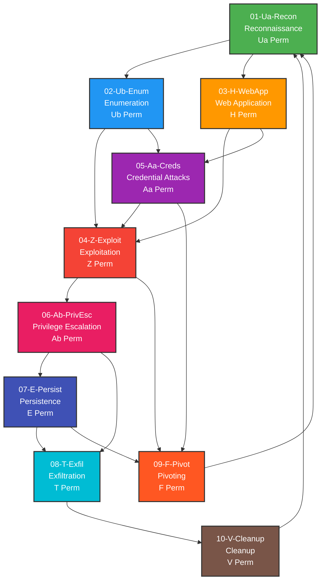

# CTF Brain Workflow Graph



## Methodology Nodes

### 🟢 01-Ua-Recon: Reconnaissance
- **PLL:** Ua Perm - M'2 U M U2 M' U M'2
- **Tools:** nmap, masscan, shodan, whois, dig, theHarvester
- **Purpose:** Initial target discovery and mapping

### 🔵 02-Ub-Enum: Enumeration
- **PLL:** Ub Perm - M'2 U' M U2 M' U' M'2
- **Tools:** gobuster, ffuf, enum4linux, smbclient, ldapsearch, snmpwalk
- **Purpose:** Deep enumeration of discovered services

### 🟠 03-H-WebApp: Web Application
- **PLL:** H Perm - M'2 U M'2 U2 M'2 U M'2
- **Tools:** burpsuite, sqlmap, nikto, wpscan, nuclei, httpx
- **Purpose:** Web application vulnerability assessment

### 🔴 04-Z-Exploit: Exploitation
- **PLL:** Z Perm - M' U M'2 U M'2 U M' U2 M'2
- **Tools:** metasploit, nc, searchsploit, pwntools, msfvenom
- **Purpose:** Gaining initial access via exploitation

### 🟣 05-Aa-Creds: Credential Attacks
- **PLL:** Aa Perm - x' R2 D2 R U R' D2 R U' R
- **Tools:** hydra, hashcat, john, crackmapexec, responder, mimikatz
- **Purpose:** Password attacks and credential harvesting

### 🔴 06-Ab-PrivEsc: Privilege Escalation
- **PLL:** Ab Perm - x' R U' R D2 R' U R D2 R2
- **Tools:** linpeas, winpeas, pspy, sudo -l, suid3num, powerup
- **Purpose:** Escalating privileges on compromised host

### 🔵 07-E-Persist: Persistence
- **PLL:** E Perm - x' R U' R' D R U R' D' R U R' D R U' R' D'
- **Tools:** cron, registry, scheduled tasks, ssh keys, implants
- **Purpose:** Maintaining access after initial compromise

### 🔵 08-T-Exfil: Exfiltration
- **PLL:** T Perm - R U R' U' R' F R2 U' R' U' R U R' F'
- **Tools:** nc, curl, dns, base64, steghide, scp
- **Purpose:** Extracting data from compromised systems

### 🟠 09-F-Pivot: Pivoting
- **PLL:** F Perm - R' U' F' R U R' U' R' F R2 U' R' U' R U R' U R
- **Tools:** chisel, ligolo, sshuttle, proxychains, socat
- **Purpose:** Moving laterally through the network

### 🟤 10-V-Cleanup: Cleanup
- **PLL:** V Perm - R' U R' U' y R' F' R2 U' R' U R' F R F
- **Tools:** history -c, shred, wevtutil, timestomp
- **Purpose:** Removing traces of compromise

## Workflow Paths

### Standard Assessment Flow
```
Recon → Enum → Exploit → PrivEsc → Persist → Exfil → Cleanup
```

### Web Application Focus
```
Recon → WebApp → Exploit → PrivEsc → Exfil → Cleanup
```

### Credential-Based Attack
```
Recon → Enum → Creds → Exploit → PrivEsc → Persist → Exfil → Cleanup
```

### Lateral Movement
```
Exploit → Pivot → Recon (internal) → Enum → Exploit (next target)
```

## Quadrant Weights

The CTF Brain uses weighted scoring to recommend the best path:

- **Tool Ready** (30%): Are the required tools available?
- **Context Match** (30%): Does this match the current situation?
- **Success Rate** (25%): Historical success rate of this approach
- **Efficiency** (15%): Time and resource considerations

## Philosophy

> "See state → Recognize pattern → Execute algorithm → Objective achieved"

Just as a Rubik's Cube speedcuber recognizes patterns and executes the perfect algorithm, 
the CTF Brain helps penetration testers recognize system states and execute the appropriate methodology.

Each phase maps to a specific PLL (Permutation of Last Layer) algorithm, creating a memorable
and intuitive framework for navigating complex security assessments.
