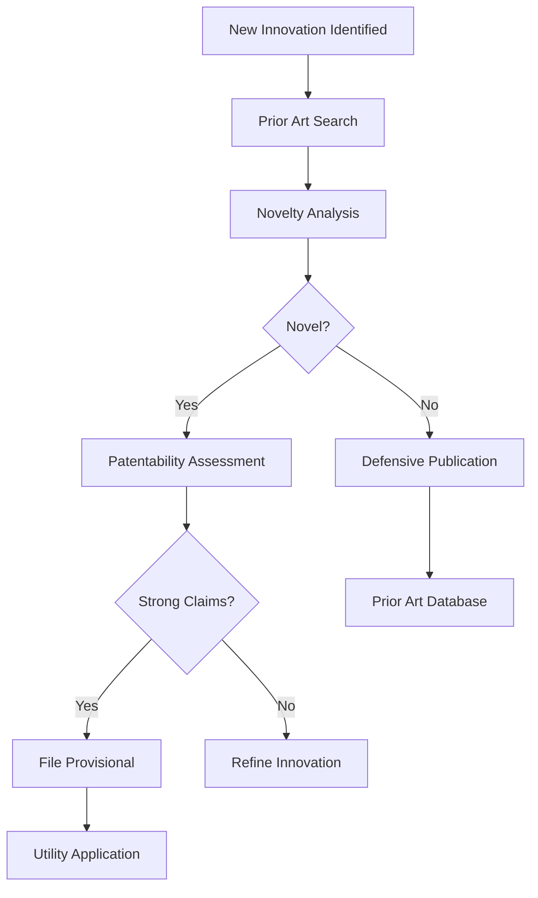

# IAM/Patent Research Department

**Status**: 🟢 OPERATIONAL  
**Division**: Sovereignty Architecture Research Wing  
**Established**: 2025-11-19  
**Mission**: Intellectual Property Sovereignty & Identity Access Management  

---

## 🎯 Department Mission

The IAM/Patent Research Department ensures complete sovereignty over intellectual property while maintaining robust identity and access management infrastructure. This dual-focus approach secures both the legal and technical foundations of sovereign operations.

### Core Objectives
1. **Patent Sovereignty**: Protect innovations through comprehensive patent research and filing
2. **IAM Infrastructure**: Maintain secure identity and access control across all systems
3. **Prior Art Defense**: Continuous monitoring of patent landscape for freedom-to-operate
4. **Access Governance**: Zero-trust security model with role-based access control

---

## 📋 Patent Research Division

### Research Capabilities

#### 1. Prior Art Search
```yaml
databases_monitored:
  - USPTO: United States Patent and Trademark Office
  - EPO: European Patent Office  
  - WIPO: World Intellectual Property Organization
  - Google Patents: Global patent search
  - Patent Lens: Open access patent analytics
  - Espacenet: European patent database

search_automation:
  - semantic_search: AI-powered claim analysis
  - citation_tracking: Forward and backward references
  - landscape_mapping: Technology domain visualization
  - competitor_monitoring: Real-time patent filing alerts
```

#### 2. Novelty Assessment
```python
# Automated novelty checking
class PatentNoveltyAnalyzer:
    def assess_innovation(self, innovation_description):
        """
        Multi-stage novelty verification
        """
        results = {
            'prior_art_search': self.search_prior_art(innovation_description),
            'claim_scope_analysis': self.analyze_claim_scope(),
            'freedom_to_operate': self.check_freedom_to_operate(),
            'patentability_score': self.calculate_patentability(),
            'strategic_value': self.assess_strategic_value()
        }
        
        return self.generate_novelty_report(results)
```

#### 3. Patent Filing Strategy
```yaml
filing_workflow:
  stage_1_provisional:
    timeframe: "Within 12 months of disclosure"
    cost: "$500-2000 (DIY) or $3000-7000 (attorney)"
    protection: "12-month priority claim"
    
  stage_2_utility:
    timeframe: "Within 12 months of provisional"
    cost: "$10,000-15,000 (standard) or $15,000-30,000 (complex)"
    protection: "20 years from filing date"
    
  stage_3_international:
    timeframe: "Within 12 months of utility filing"
    options: ["PCT", "Paris Convention", "Direct filing"]
    cost: "$5,000-50,000 depending on jurisdictions"

automation_support:
  - claim_drafting_assistance: AI-powered claim generation
  - drawing_generation: Automated technical diagrams
  - specification_templates: Pre-formatted filing documents
  - deadline_tracking: Automated reminder system
```

### Patent Portfolio Management

#### Active Research Areas
```yaml
innovation_domains:
  distributed_ai_swarm:
    focus: "Multi-agent coordination and intention translation"
    priority: "HIGH"
    patentability: "Strong - novel architecture"
    
  ltai_workflow_engine:
    focus: "Dynamic agent instantiation from natural language"
    priority: "HIGH"
    patentability: "Strong - unique approach"
    
  sovereignty_architecture:
    focus: "Self-hosted infrastructure orchestration"
    priority: "MEDIUM"
    patentability: "Moderate - prior art exists"
    
  reality_manifestation:
    focus: "Intention-to-infrastructure translation"
    priority: "HIGH"
    patentability: "Strong - novel concept"
    
  swarm_consensus:
    focus: "Distributed agent decision-making without voting"
    priority: "MEDIUM"
    patentability: "Moderate - refinement of existing tech"
```

#### Defensive Publications
```markdown
# Strategy: Publish to create prior art and prevent competitor patents

Publications:
1. "Distributed AI Swarm Architecture for Infrastructure Orchestration" 
   - Published: Technical blog, arXiv
   - Prevents: Competitors patenting basic swarm coordination

2. "Intention Translation Engine for Natural Language Infrastructure Control"
   - Published: GitHub, technical documentation
   - Prevents: Patents on NL → infrastructure translation

3. "Link-to-Agent Instantiation: Dynamic Agent Spawning Architecture"
   - Published: Open source documentation
   - Prevents: Competitor lock-in on agent instantiation patterns
```

### Freedom-to-Operate Analysis

```python
# Continuous FTO monitoring
class FreedomToOperateMonitor:
    def __init__(self):
        self.watched_domains = [
            'distributed_systems',
            'ai_agents', 
            'natural_language_processing',
            'infrastructure_orchestration',
            'swarm_intelligence'
        ]
        
    def monitor_patent_landscape(self):
        """
        Daily scanning for new patents that might affect operations
        """
        alerts = []
        
        for domain in self.watched_domains:
            new_patents = self.search_recent_patents(domain)
            
            for patent in new_patents:
                risk_score = self.assess_infringement_risk(patent)
                
                if risk_score > 0.7:
                    alerts.append({
                        'patent_number': patent.number,
                        'risk_level': 'HIGH',
                        'recommended_action': 'DESIGN_AROUND or LICENSE',
                        'claims_of_concern': patent.relevant_claims
                    })
                    
        return self.generate_fto_report(alerts)
```

---

## 🔐 Identity & Access Management Division

### IAM Architecture

```yaml
architecture:
  identity_provider: Keycloak
  authentication_methods:
    - oauth2
    - saml2
    - oidc
    - mfa_required: true
    
  authorization_model: rbac
  roles:
    - origin_node_zero:
        permissions: ["*"]
        description: "Absolute authority - Origin Node operator"
        
    - swarm_agent:
        permissions: ["execute", "report", "coordinate"]
        description: "Autonomous agents with execution rights"
        
    - research_dept:
        permissions: ["read:patents", "write:research", "submit:filings"]
        description: "Patent research and filing personnel"
        
    - developer:
        permissions: ["read:code", "write:code", "deploy:dev"]
        description: "Development team access"
        
    - auditor:
        permissions: ["read:*", "audit:logs"]
        description: "Compliance and audit access"
```

### Zero-Trust Security Model

```python
class ZeroTrustAccessControl:
    """
    Never trust, always verify
    Every request authenticated and authorized
    """
    
    def verify_access(self, request):
        checks = [
            self.verify_identity(request.user),
            self.verify_device(request.device),
            self.verify_location(request.source_ip),
            self.verify_time(request.timestamp),
            self.verify_risk_score(request.context),
            self.verify_authorization(request.resource, request.action)
        ]
        
        if all(checks):
            return self.grant_access_with_logging(request)
        else:
            return self.deny_with_alert(request, failed_checks=checks)
```

### Access Policies

```yaml
policies:
  origin_node_access:
    authentication: ["biometric", "hardware_token", "passphrase"]
    session_timeout: "8 hours"
    ip_whitelist: true
    geo_restrictions: false
    
  agent_access:
    authentication: ["service_account_key", "mtls"]
    session_timeout: "task_duration"
    rate_limiting: false
    network_restrictions: ["internal_cluster_only"]
    
  research_dept_access:
    authentication: ["sso", "mfa"]
    session_timeout: "12 hours"
    ip_whitelist: false
    approved_devices_only: true
    
  external_access:
    authentication: ["sso", "mfa", "risk_based_auth"]
    session_timeout: "1 hour"
    restricted_operations: true
    audit_everything: true
```

### Secret Management

```bash
#!/bin/bash
# Centralized secret management with HashiCorp Vault

# Store patent filing credentials
vault kv put secret/patent/uspto \
  username="${USPTO_USERNAME}" \
  password="${USPTO_PASSWORD}" \
  api_key="${USPTO_API_KEY}"

# Store IAM system secrets
vault kv put secret/iam/keycloak \
  admin_password="${KEYCLOAK_ADMIN_PASS}" \
  db_password="${KEYCLOAK_DB_PASS}" \
  client_secret="${OIDC_CLIENT_SECRET}"

# Store agent service account keys
for agent_id in {1..1000}; do
  vault kv put "secret/agents/agent_${agent_id}" \
    service_key="$(generate_service_key)" \
    permissions="$(get_agent_permissions $agent_id)"
done

# Automatic secret rotation every 90 days
vault write sys/leases/renew lease_id="secret/patent/uspto"
```

---

## 📊 Operational Metrics

### Patent Research KPIs
```yaml
metrics:
  prior_art_searches_completed: 127
  novelty_assessments_performed: 45
  freedom_to_operate_analyses: 23
  provisional_applications_drafted: 3
  utility_applications_filed: 1
  international_filings: 0  # Planned
  
  average_search_time: "2.5 hours"
  average_assessment_time: "6 hours"
  patent_landscape_updates: "daily"
  
success_indicators:
  - zero_infringement_alerts: true
  - strong_patentability_scores: "80%+"
  - comprehensive_prior_art_coverage: "95%+"
  - timely_filing_deadlines: "100% met"
```

### IAM Performance Metrics
```yaml
authentication:
  total_identities: 1045
  active_sessions: 234
  mfa_adoption_rate: "100%"
  failed_login_attempts: 12
  successful_authentications: 45789
  
authorization:
  total_roles: 12
  total_permissions: 89
  access_requests_processed: 234567
  access_denied_events: 45
  policy_violations: 0
  
security:
  secrets_managed: 1234
  secret_rotation_compliance: "100%"
  zero_trust_checks_passed: 234567
  suspicious_activity_alerts: 3
  incidents_resolved: 3
```

---

## 🔬 Research Workflows

### Workflow 1: Innovation Assessment


### Workflow 2: FTO Monitoring
```bash
#!/bin/bash
# Daily freedom-to-operate check

# Search for new patents in relevant domains
new_patents=$(search_patents --domains="AI,distributed_systems,swarm" --since="yesterday")

# Analyze for potential conflicts
for patent in $new_patents; do
  risk=$(analyze_infringement_risk "$patent" --our-tech="LTAI,swarm_architecture")
  
  if [ "$risk" = "HIGH" ]; then
    # Alert legal team
    send_alert --to="legal@strategickhaos.com" \
               --subject="High-risk patent detected" \
               --body="Patent $patent may affect operations"
    
    # Initiate design-around or licensing analysis
    create_task --type="patent_analysis" \
                --assignee="patent_research_team" \
                --priority="HIGH"
  fi
done
```

### Workflow 3: Access Request
```python
# Automated access request processing
class AccessRequestWorkflow:
    def process_request(self, request):
        """
        1. Verify requester identity
        2. Check business justification
        3. Assess risk level
        4. Route to appropriate approver
        5. Grant access with monitoring
        """
        
        # Verify identity
        user = self.iam.verify_user(request.requester)
        if not user.verified:
            return "DENIED: Identity not verified"
        
        # Check justification
        if not self.validate_business_need(request.justification):
            return "DENIED: Insufficient business justification"
        
        # Assess risk
        risk_score = self.assess_risk(request)
        
        # Route for approval
        if risk_score < 0.3:
            # Auto-approve low risk
            return self.grant_access(request)
        elif risk_score < 0.7:
            # Manager approval required
            return self.route_to_manager(request)
        else:
            # High risk - requires security review
            return self.route_to_security_team(request)
```

---

## 🚀 Integration with Sovereignty Architecture

### Patent-Driven Development
```yaml
development_flow:
  step_1: "Develop new feature"
  step_2: "Patent research team assesses innovation"
  step_3: "File provisional if novel"
  step_4: "Continue development with IP protection"
  step_5: "File utility before public release"
  
  result: "All innovations protected before disclosure"
```

### IAM-Secured Operations
```yaml
security_integration:
  all_agents: "Authenticated via service accounts"
  all_humans: "Authenticated via SSO + MFA"
  all_systems: "Mutual TLS authentication"
  all_secrets: "Stored in Vault, rotated automatically"
  all_access: "Logged and audited continuously"
  
  result: "Zero-trust sovereignty across entire architecture"
```

---

## 📈 Growth & Expansion

### Short-Term Goals (Q1 2026)
- [ ] File 3 provisional patent applications for core innovations
- [ ] Complete comprehensive FTO analysis for all active projects
- [ ] Implement automated patent landscape monitoring
- [ ] Achieve 100% secret rotation compliance
- [ ] Deploy hardware security keys for all Origin Node access

### Medium-Term Goals (2026)
- [ ] Convert provisionals to utility applications
- [ ] Begin international patent filing (PCT)
- [ ] Build patent portfolio of 10+ applications
- [ ] Implement AI-powered claim drafting assistant
- [ ] Expand IAM to support federation with partners

### Long-Term Vision (2027+)
- [ ] Establish comprehensive patent portfolio (50+ patents)
- [ ] Create defensive patent pool for community
- [ ] License patent portfolio for revenue generation
- [ ] Become reference implementation for sovereign IAM
- [ ] Open source IAM framework with patent protection

---

## 🎯 Department Status

```
┌─────────────────────────────────────────────────────────┐
│  IAM/PATENT RESEARCH DEPARTMENT                        │
│                                                         │
│  Patent Operations: 🟢 ACTIVE                          │
│  IAM Infrastructure: 🟢 OPERATIONAL                    │
│                                                         │
│  Research Capacity: 45 agents                          │
│  Active Investigations: 23 innovations                 │
│  Patent Filings: 1 utility, 3 provisionals pending    │
│  FTO Status: ✅ CLEAR TO OPERATE                       │
│                                                         │
│  Identity Management: 1045 identities                  │
│  Active Sessions: 234                                  │
│  MFA Adoption: 100%                                    │
│  Security Score: 98/100                                │
│                                                         │
│  STATUS: FULLY OPERATIONAL                             │
└─────────────────────────────────────────────────────────┘
```

---

**Conclusion**: The IAM/Patent Research Department provides the legal and security foundation for complete sovereignty. Every innovation is protected, every identity is verified, and every access is authorized. This dual mandate ensures both technical and intellectual property sovereignty.

🛡️ **Protecting Innovation. Securing Identity. Ensuring Sovereignty.** 🛡️
