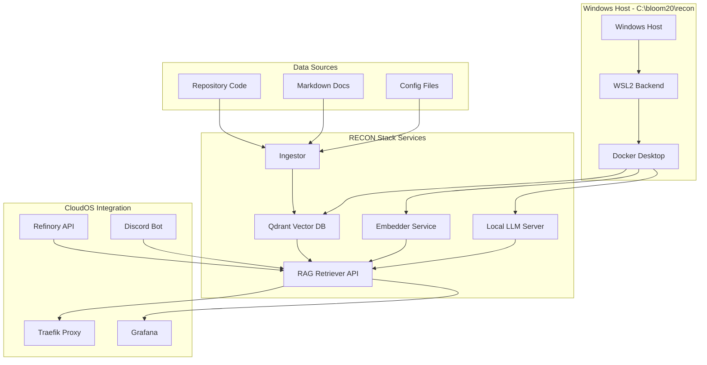

# 🎯 RECON STACK v2 - Windows Sovereign RAG Integration
# Strategic Khaos Enhanced RAG System

## Executive Summary
**Windows-native RAG stack integrated with CloudOS for sovereign AI operations**

Building on our existing Strategic Khaos CloudOS platform, RECON STACK v2 adds:
- **Local RAG (Retrieval Augmented Generation)** capability
- **Windows-optimized container stack** with WSL2 backend
- **Cross-platform integration** with existing CloudOS services
- **Sovereign AI** with no external dependencies

---

## Integration Architecture



---

## File Structure

```
C:\bloom20\recon\
├── docker-compose-recon.yml    # RECON stack services
├── .env.recon                  # Environment configuration
├── ingest/
│   ├── ingest.py              # Enhanced repo indexer
│   ├── requirements.txt       # Python dependencies
│   └── config.yml             # Ingestion settings
├── retriever/
│   ├── api.py                 # FastAPI RAG endpoint
│   ├── requirements.txt       # API dependencies
│   └── prompts.yml            # LLM prompt templates
├── repos/                     # Source repositories
│   └── sovereignty-arch/      # Our current repo
├── models/
│   └── bge-small-en-v1.5.gguf # Local embedding model
├── dashboards/
│   └── recon-grafana.json     # RAG metrics dashboard
└── integration/
    ├── cloudos-bridge.py      # CloudOS integration
    └── discord-commands.py    # RAG Discord commands
```

---

## Enhanced Services Configuration

### Primary Stack (docker-compose-recon.yml)
- **Qdrant Vector Database**: High-performance vector storage
- **BGE Embedder**: Local sentence transformer service  
- **Llama.cpp Server**: Local LLM inference
- **FastAPI Retriever**: RAG query endpoint
- **Code Ingestor**: Repository indexing service

### CloudOS Bridge Integration
- **Traefik Routes**: Proxy RAG API through existing gateway
- **Grafana Dashboards**: RAG query metrics and accuracy
- **Discord Commands**: `/ask`, `/search`, `/explain` commands
- **Refinory Integration**: RAG-augmented AI expert responses

---

## Windows Optimization Features

### Docker Desktop WSL2 Backend
```powershell
# Optimized resource allocation
wsl --set-version Ubuntu 2
wsl --set-default-version 2

# Docker Desktop settings
- Enable WSL2 backend
- Allocate 8GB RAM to WSL2
- Enable experimental features
```

### Windows Volume Mounting
```yaml
volumes:
  # Windows path optimization
  - C:/bloom20/recon/repos:/repos:ro,cached
  - C:/bloom20/models:/models:ro,cached
  # WSL2 performance optimizations
  - type: tmpfs
    target: /tmp/embeddings
    tmpfs:
      size: 2G
```

### Resource Management
```yaml
deploy:
  resources:
    limits:
      memory: 6G      # LLM inference
      cpus: '4'       # Embedding processing  
    reservations:
      memory: 2G
      cpus: '2'
```

---

## RAG Query Pipeline

### 1. Document Ingestion
```python
# Enhanced chunk strategy
CHUNK_TOKENS = 400      # Optimal for BGE model
OVERLAP = 60           # Context preservation  
RELEVANCE_THRESHOLD = 0.7  # Quality filtering

# Multi-format support
SUPPORTED_FORMATS = {
    '.py', '.ts', '.tsx', '.js', '.java', '.go', 
    '.rs', '.cs', '.cpp', '.h', '.md', '.yaml', 
    '.yml', '.toml', '.json', '.txt'
}
```

### 2. Vector Search & Retrieval
```python
# Semantic search with filtering
async def semantic_search(query: str, filters: dict = None):
    # Generate query embedding
    query_vector = await embedder.encode(query)
    
    # Search with metadata filtering
    results = qdrant_client.search(
        collection_name="sovereignty-arch",
        query_vector=query_vector,
        limit=8,
        query_filter=filters,
        score_threshold=0.7
    )
    
    return results
```

### 3. Context Assembly & LLM Generation
```python
# RAG prompt engineering
SYSTEM_PROMPT = """
You are an expert software architect analyzing the Strategic Khaos 
sovereignty architecture. Use ONLY the provided code context to 
answer questions accurately and comprehensively.

Context Guidelines:
- Cite specific files and line ranges
- Explain architectural patterns
- Identify integration points  
- Suggest improvements based on existing patterns
"""
```

---

## CloudOS Integration Points

### Discord Bot Commands
```python
@bot.slash_command(name="ask", description="Query codebase with RAG")
async def ask_codebase(ctx, question: str, repo: str = "sovereignty-arch"):
    # Query RAG API
    response = await rag_client.query({
        "q": question,
        "k": 8,
        "collection": repo,
        "include_context": True
    })
    
    # Format Discord response with context
    embed = discord.Embed(
        title="🔍 RAG Query Result",
        description=response["answer"],
        color=0x00ff00
    )
    
    # Add source references
    sources = "\n".join([
        f"📁 `{src['path']}:{src['chunk']}`" 
        for src in response["sources"][:3]
    ])
    embed.add_field(name="Sources", value=sources, inline=False)
    
    await ctx.respond(embed=embed)
```

### Grafana RAG Metrics
```yaml
# RAG performance dashboard
panels:
  - title: "Query Latency Distribution"
    type: "histogram"
    targets:
      - expr: "rag_query_duration_seconds_bucket"
        
  - title: "Embedding Cache Hit Rate"  
    type: "stat"
    targets:
      - expr: "rate(embedding_cache_hits_total) / rate(embedding_requests_total)"
        
  - title: "Context Relevance Scores"
    type: "graph" 
    targets:
      - expr: "rag_context_relevance_score"
```

### Traefik Integration
```yaml
# RAG API routing
http:
  routers:
    rag-api:
      rule: "Host(`rag.localhost`) || PathPrefix(`/api/rag`)"
      service: rag-service
      
  services:
    rag-service:
      loadBalancer:
        servers:
          - url: "http://localhost:7000"
```

---

## Performance Optimizations

### Embedding Cache Strategy
```python
# Redis-backed embedding cache
@cache(ttl=3600, key_builder=lambda q: f"embed:{hash(q)}")
async def get_embedding(text: str) -> List[float]:
    return await embedder_service.encode(text)
```

### Batch Processing
```python
# Concurrent ingestion with batching
async def ingest_repository(repo_path: str, batch_size: int = 64):
    files = discover_files(repo_path)
    
    async with asyncio.TaskGroup() as tg:
        for batch in chunked(files, batch_size):
            tg.create_task(process_file_batch(batch))
```

### Resource Monitoring
```python
# Performance metrics collection
RAG_QUERY_DURATION = Histogram(
    'rag_query_duration_seconds',
    'RAG query processing time',
    buckets=[0.1, 0.5, 1.0, 2.0, 5.0]
)

CONTEXT_RELEVANCE = Gauge(
    'rag_context_relevance_score',
    'Average relevance score of retrieved contexts'
)
```

---

## Security & Privacy

### Local-First Architecture
- **No external API calls** for embeddings or LLM inference
- **Local vector storage** with Qdrant
- **Encrypted volumes** for sensitive repositories
- **Access control** through CloudOS authentication

### Data Sovereignty
```yaml
# Privacy-preserving configuration
environment:
  - TELEMETRY_ENABLED=false
  - EXTERNAL_LOGGING=false
  - MODEL_UPDATES=disabled
  - ANALYTICS_OPT_OUT=true
```

---

## Deployment & Operations

### Windows Setup Script
```powershell
# setup-recon.ps1 - Complete RECON stack deployment

# 1. Verify prerequisites
if (-not (Get-Command docker -ErrorAction SilentlyContinue)) {
    Write-Error "Docker Desktop required. Install from: https://docker.com/desktop"
    exit 1
}

# 2. Create directory structure
New-Item -Path "C:\bloom20\recon" -ItemType Directory -Force
New-Item -Path "C:\bloom20\recon\repos" -ItemType Directory -Force
New-Item -Path "C:\bloom20\models" -ItemType Directory -Force

# 3. Download BGE model
Invoke-WebRequest -Uri "https://huggingface.co/BAAI/bge-small-en-v1.5/resolve/main/model.gguf" `
                  -OutFile "C:\bloom20\models\bge-small-en-v1.5.gguf"

# 4. Start RECON stack
Set-Location "C:\bloom20\recon"
docker-compose -f docker-compose-recon.yml up -d --build

# 5. Integrate with CloudOS
docker network connect sovereignty-architecture-elevator-pitch-_cloudos_network recon-retriever
```

### Health Checks & Monitoring
```bash
# RECON stack health verification
curl http://localhost:6333/healthz          # Qdrant vector DB
curl http://localhost:8080/health           # LLM server  
curl http://localhost:8081/health           # Embedder
curl http://localhost:7000/health           # RAG API

# Integration testing
curl -X POST http://localhost:7000/query \
  -H "Content-Type: application/json" \
  -d '{"q": "How does the contradiction engine work?", "k": 5}'
```

---

## Usage Examples

### 1. Repository Analysis
```bash
# Index the Strategic Khaos repository
docker-compose run --rm ingestor /repos/sovereignty-architecture-elevator-pitch

# Query architectural patterns
curl -X POST localhost:7000/query -d '{
  "q": "Explain the Discord bot integration architecture",
  "k": 8,
  "path_prefix": "src/"
}'
```

### 2. Code Search & Explanation  
```bash
# Find specific implementations
curl -X POST localhost:7000/query -d '{
  "q": "Show me how contradictions are converted to revenue streams",
  "k": 5,
  "path_prefix": "contradictions/"
}'
```

### 3. Documentation Generation
```bash
# Generate architectural documentation
curl -X POST localhost:7000/query -d '{
  "q": "Document the complete CloudOS service dependency graph",
  "k": 12
}'
```

---

## Next Steps

### Immediate Actions
1. **Deploy RECON stack** alongside CloudOS
2. **Index current repository** for immediate RAG capability  
3. **Add Discord commands** for team RAG access
4. **Configure Grafana** for RAG metrics monitoring

### Advanced Features  
1. **Multi-repository indexing** for comprehensive knowledge base
2. **Semantic code search** with natural language queries
3. **Automated documentation** generation from codebase analysis
4. **AI-assisted refactoring** suggestions based on patterns

### Integration Roadmap
1. **Week 1**: Basic RAG deployment and repository indexing
2. **Week 2**: Discord bot integration and team onboarding  
3. **Week 3**: Advanced search and documentation features
4. **Week 4**: Performance optimization and scaling

---

## Conclusion

**RECON STACK v2** transforms our Strategic Khaos platform into a **comprehensive sovereign AI system** with:

- **Local RAG capability** for instant codebase intelligence
- **Windows-native optimization** for development environments  
- **CloudOS integration** for unified operations
- **Privacy-first architecture** with no external dependencies

This creates the ultimate **"Discord-native DevOps with AI sovereignty"** - where every code question gets instant, accurate answers from your own repository knowledge base.

**Ready to launch RECON DRILL and transform codebase intelligence!** 🚀