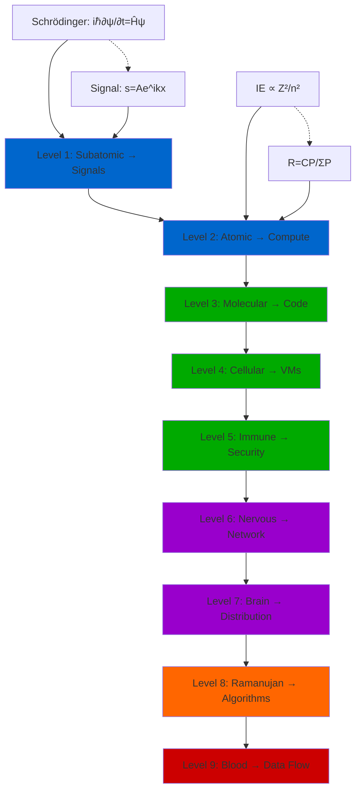

# GraphView Visualization Guide for DOM Mapping

## Overview

This guide explains how to visualize the DOM Mapping mathematical formulas in Microsoft GraphView tools (Power BI, Visio, or other graph visualization tools).

## Node Structure

### Level Nodes (Primary)

Each of the 9 levels becomes a primary node:

| Node ID | Label | Color | Category |
|---------|-------|-------|----------|
| L1 | Subatomic → Signals | Blue | Physics |
| L2 | Atomic → Compute | Blue | Physics |
| L3 | Molecular → Code | Green | Biology |
| L4 | Cellular → VMs | Green | Biology |
| L5 | Immune → Security | Green | Biology |
| L6 | Nervous → Network | Purple | Bio/Infra |
| L7 | Brain → Distribution | Purple | Bio/Infra |
| L8 | Ramanujan → Algorithms | Orange | Math |
| L9 | Blood → Data Flow | Red | Physics |

### Formula Nodes (Secondary)

Each level has 2 formula nodes:

| Node ID | Label | Type | Parent |
|---------|-------|------|--------|
| L1-P | Schrödinger Equation | Physics | L1 |
| L1-I | Wave Packet Propagation | Infrastructure | L1 |
| L2-P | Ionization Energy | Physics | L2 |
| L2-I | Resource Allocation | Infrastructure | L2 |
| ... | ... | ... | ... |

## Edge Structure

### Hierarchical Edges (Sequential)

Connect levels in order:

```
L1 → L2 → L3 → L4 → L5 → L6 → L7 → L8 → L9
```

**Edge Properties:**
- Type: "sequential"
- Weight: 1
- Label: "builds upon"

### Analogy Edges (Cross-domain)

Connect physics/biology to infrastructure:

```
L1-P ─[analogous to]→ L1-I
L2-P ─[analogous to]→ L2-I
...
```

**Edge Properties:**
- Type: "analogy"
- Weight: 0.8
- Label: "maps to"
- Style: dashed line

### Cross-Level Connections

Some concepts span multiple levels:

```
L1 (Signals) ─[scales to]→ L6 (Network)
L3 (DNA/Code) ─[implements]→ L4 (Containers)
L4 (VMs) ─[protected by]→ L5 (Security)
```

## Power BI Implementation

### Step 1: Prepare Data Tables

**Nodes Table:**
```csv
NodeID,Label,Type,Level,Formula,Color
L1,Subatomic→Signals,Physics,1,"i ℏ ∂ψ/∂t = Ĥψ",#0066CC
L1-P,Schrödinger,Formula,1,"[Full LaTeX]",#0088FF
L1-I,Wave Packet,Formula,1,"s(t) = A e^(ikx-ωt)",#00AAFF
...
```

**Edges Table:**
```csv
Source,Target,Type,Label,Weight
L1,L2,sequential,builds upon,1.0
L1-P,L1-I,analogy,maps to,0.8
L2,L3,sequential,builds upon,1.0
...
```

### Step 2: Create Network Graph Visual

1. Add "Network Graph" visual to Power BI report
2. Map NodeID to nodes
3. Map Source/Target to edges
4. Use Label field for node labels
5. Color nodes by Type or Level

### Step 3: Add Formula Tooltips

Configure tooltips to display full LaTeX formulas (converted to Unicode):

```
Formula: ψ(x,t) = A e^(i(kx-ωt))
Variables:
  • ψ = wave function
  • k = wave number
  • ω = angular frequency
```

## Visio Implementation

### Creating the Diagram

1. **Layout**: Use Hierarchical layout (top-to-bottom)
2. **Shapes**: 
   - Rectangles for level nodes
   - Rounded rectangles for formula nodes
3. **Connectors**: 
   - Solid arrows for sequential
   - Dashed arrows for analogies

### Shape Data

For each shape, add custom properties:

```
Name: Level 1
Type: Physics
Formula: [LaTeX as text]
Source: Schrödinger equation
Year: 1926
Application: Quantum mechanics → Signal processing
```

### Using Equation Editor

Visio has built-in equation editor:
1. Insert → Equation
2. Type LaTeX-like syntax
3. Renders as formatted equation

## Mermaid Graph (Alternative)

For markdown-based tools, use Mermaid:



## Export Formats

### For Presentations

1. **PNG/SVG**: Export high-resolution for slides
2. **Interactive HTML**: For web-based presentations
3. **PDF**: For printed materials

### For Documentation

1. **Markdown with Mermaid**: Keep in version control
2. **Obsidian Canvas**: Export to image/PDF
3. **GraphML**: Import into other tools (Gephi, yEd)

## Interactive Features

### Zoom & Filter

Configure interactive controls:
- Zoom in on specific level
- Filter by domain (Physics/Biology/Infrastructure)
- Highlight paths (e.g., signal flow: L1→L6→L9)

### Formula Details Panel

On node click, show:
- Full LaTeX formula
- Variable definitions
- Physical interpretation
- Infrastructure application
- Related equations

## Example Queries

### Show All Physics Formulas
```
Filter: Type = "Physics"
Highlight: Blue
```

### Find Dependencies of Level 6
```
Query: All edges where Target = "L6"
Show: Source nodes and formulas
```

### Trace Signal Flow
```
Path: L1 → L6 → L9
Highlight: Nodes in path
Label: "Signal/Data Flow Chain"
```

## Tools Comparison

| Feature | Power BI | Visio | Obsidian | Mermaid |
|---------|----------|-------|----------|---------|
| Interactive | ✅ | ✅ | ✅ | ⚠️ |
| LaTeX Support | ⚠️ | ⚠️ | ✅ | ❌ |
| Export Quality | ✅ | ✅ | ✅ | ⚠️ |
| Ease of Use | ⚠️ | ✅ | ✅ | ✅ |
| Cost | $$$ | $$$ | $ | Free |

**Legend**: ✅ Full support, ⚠️ Partial/workaround, ❌ Not supported

## Next Steps

1. Choose your visualization tool based on requirements
2. Export node/edge data from Obsidian or source files
3. Import into GraphView tool
4. Configure layout and styling
5. Add interactivity and tooltips
6. Export for sharing/presentation

---

**Related**: [[DOM_MAPPING_MATHEMATICAL_FORMULAS.md]] | [[Obsidian README]]
