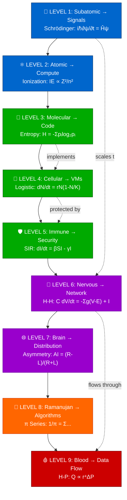
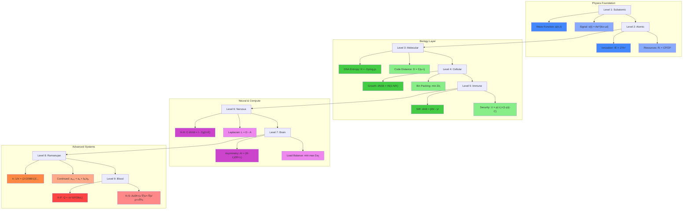
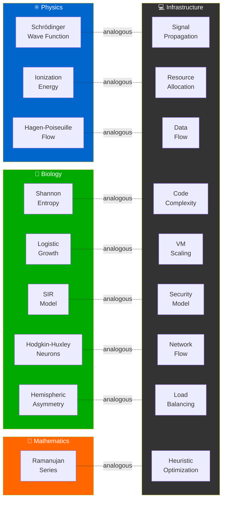
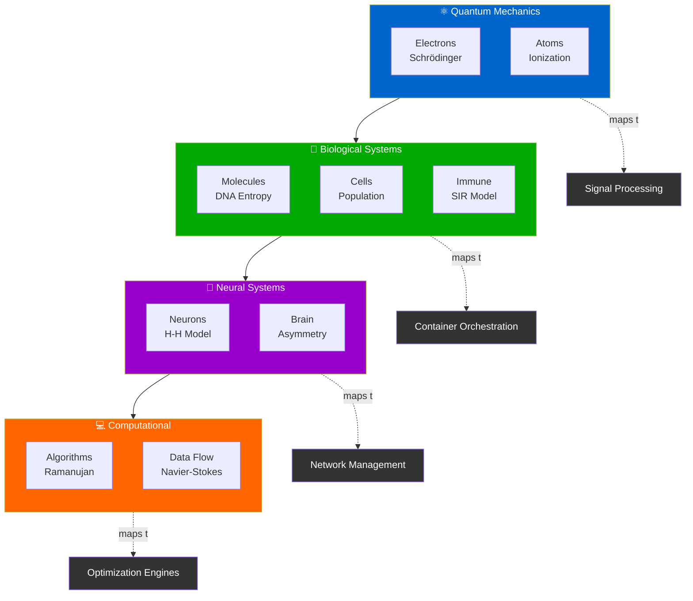

# DOM Mapping Visual Diagram (Mermaid)

This document contains Mermaid diagrams for visualizing the DOM Mapping architecture.

## Complete DOM Architecture



## Hierarchical View with Formulas



## Analogy Flow (Physics/Biology → Infrastructure)



## Simplified Level Flow


## Domain Clustering



## Usage Instructions

### Viewing Mermaid Diagrams

1. **In GitHub**: Mermaid renders automatically in .md files
2. **In Obsidian**: Install "Mermaid" plugin for live rendering
3. **In VS Code**: Install "Markdown Preview Mermaid Support" extension
4. **Online**: Use [Mermaid Live Editor](https://mermaid.live/)

### Exporting Diagrams

1. **PNG/SVG**: Use Mermaid CLI
   ```bash
   npm install -g @mermaid-js/mermaid-cli
   mmdc -i MERMAID_DIAGRAMS.md -o diagram.png
   ```

2. **PDF**: Convert via pandoc
   ```bash
   pandoc MERMAID_DIAGRAMS.md -o output.pdf
   ```

3. **Interactive HTML**: 
   ```bash
   mmdc -i MERMAID_DIAGRAMS.md -o diagram.html
   ```

### Customization

Modify colors, shapes, and labels in the Mermaid code:
- `fill:#COLOR` - Node background
- `stroke:#COLOR` - Node border
- `color:#COLOR` - Text color
- `-->` - Solid arrow
- `-.->` - Dashed arrow

### Integration with Other Tools

- **Obsidian**: Copy Mermaid code blocks into notes
- **Confluence**: Use Mermaid macro
- **Notion**: Use third-party Mermaid integration
- **Markdown**: Include directly in .md files

---

**Related Files:**
- [[DOM_MAPPING_MATHEMATICAL_FORMULAS.md]] - Full formulas with LaTeX
- [[GRAPHVIEW_GUIDE.md]] - Power BI/Visio instructions
- [[Obsidian README]] - Vault setup guide
