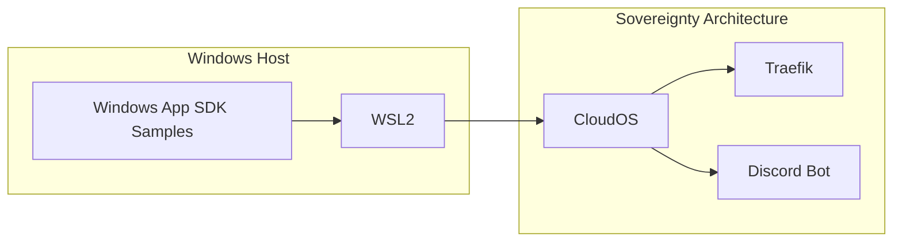

# Windows App SDK Experimental Samples

Reference documentation for Microsoft's Windows App SDK experimental samples, integrated with the Sovereignty Architecture ecosystem.

## Overview

The **Windows App SDK** provides a unified set of APIs and tools for building native Windows applications. The experimental branch contains cutting-edge features and samples demonstrating the latest capabilities.

## Official Repository

🔗 **[WindowsAppSDK-Samples (Experimental Branch)](https://github.com/microsoft/WindowsAppSDK-Samples/tree/release/experimental)**

This repository contains sample applications showcasing experimental features of the Windows App SDK.

## Key Features in Experimental Samples

- **WinUI 3** - Modern UI framework for Windows apps
- **App Lifecycle** - Advanced application lifecycle management
- **Windowing** - Enhanced window management APIs
- **Push Notifications** - Cloud-powered notification support
- **Deployment** - Self-contained and framework-dependent deployment
- **DWriteCore** - Cross-platform text rendering
- **MRT Core** - Resource management system

## Integration with Sovereignty Architecture

### Windows-Native Development

The Windows App SDK samples complement our existing Windows-optimized stack:

```yaml
sovereignty_stack:
  windows_integration:
    - Windows 11 + Docker Desktop (WSL2)
    - Native Windows development environment
    - Windows App SDK experimental features
    - CloudOS cross-platform compatibility
```

### Development Environment Setup

```bash
# 1. Clone the Windows App SDK samples
git clone https://github.com/microsoft/WindowsAppSDK-Samples.git
cd WindowsAppSDK-Samples
git checkout release/experimental

# 2. Install Windows App SDK prerequisites
# - Visual Studio 2022 (17.0 or later)
# - Windows 11 SDK (22000 or later)
# - .NET 6.0 SDK or later

# 3. Open samples in Visual Studio
# Navigate to specific sample directories and open .sln files
```

## Sample Categories

### 1. **WinUI 3 Samples**
Modern UI components and controls for Windows applications

### 2. **App Lifecycle Samples**
- Activation handling
- Background tasks
- App instancing
- Power management

### 3. **Windowing Samples**
- Custom title bars
- Window customization
- Multi-window applications
- AppWindow APIs

### 4. **Deployment Samples**
- MSIX packaging
- Self-contained deployments
- Framework-dependent deployments

## Sovereignty Considerations

### Local-First Development
- **No Cloud Dependencies**: Samples can run entirely on local Windows machines
- **Self-Contained**: All resources and dependencies bundled with application
- **Sovereign Control**: Full control over application lifecycle and data

### Integration Points



## Building Your First Sample

### Example: WinUI 3 Gallery

```bash
# 1. Navigate to WinUI 3 sample
cd Samples/WinUI3

# 2. Open in Visual Studio
start WinUI3Gallery.sln

# 3. Build and run (F5)
# The application will launch showcasing WinUI 3 controls
```

### Running with CloudOS Integration

```powershell
# From PowerShell on Windows host
# 1. Start CloudOS environment
.\start-cloudos.ps1

# 2. Build Windows App SDK sample
cd path\to\WindowsAppSDK-Samples\Samples\YourSample
dotnet build

# 3. Run the sample
dotnet run
```

## Best Practices

### 1. **Version Management**
- Track experimental features carefully
- Test compatibility with Windows 11
- Monitor for breaking changes in experimental branch

### 2. **Deployment Strategy**
- Use MSIX for distribution
- Consider self-contained deployment for sovereignty
- Test on target Windows versions

### 3. **Security Considerations**
- Review experimental features for production readiness
- Implement proper sandboxing
- Follow Windows security best practices

## Resources

### Official Documentation
- [Windows App SDK Documentation](https://docs.microsoft.com/windows/apps/windows-app-sdk/)
- [WinUI 3 Documentation](https://docs.microsoft.com/windows/apps/winui/winui3/)
- [Experimental Features Guide](https://github.com/microsoft/WindowsAppSDK/blob/main/docs/experimental-features.md)

### Community Resources
- [Windows Developer Blog](https://blogs.windows.com/windowsdeveloper/)
- [WinUI Community Toolkit](https://github.com/CommunityToolkit/Windows)
- [Windows App SDK Discussions](https://github.com/microsoft/WindowsAppSDK/discussions)

## Compatibility with Sovereignty Stack

| Component | Windows App SDK | CloudOS Integration |
|-----------|----------------|---------------------|
| **Platform** | Windows 11+ | WSL2, Docker Desktop |
| **Development** | Visual Studio 2022 | VS Code, JetBrains |
| **Runtime** | .NET 6+, Native | Cross-platform containers |
| **UI Framework** | WinUI 3 | Web UI, Terminal UI |
| **Deployment** | MSIX, Self-contained | Docker, Kubernetes |

## Experimental Features to Watch

### Current Experimental Features (as of 2024)
- **Advanced Windowing APIs** - New window management capabilities
- **Enhanced App Lifecycle** - Improved background task management
- **Modern File Dialogs** - Updated file picker experiences
- **System Backdrop APIs** - Mica and Acrylic material support

### Integration Opportunities
1. **Discord Bot Integration** - Native Windows notifications for bot events
2. **GitLens Integration** - Windows-native PR review tools
3. **Development Dashboard** - WinUI 3 dashboard for CloudOS monitoring
4. **Deployment Automation** - MSIX packaging for sovereign applications

## Contributing

To contribute Windows App SDK examples to the Sovereignty Architecture:

1. **Fork** both repositories
2. **Create** integration examples in `examples/windows-app-sdk/`
3. **Document** sovereignty-specific considerations
4. **Test** with CloudOS environment
5. **Submit** PR with detailed integration guide

## Support

For Windows App SDK specific issues:
- [Windows App SDK GitHub Issues](https://github.com/microsoft/WindowsAppSDK/issues)
- [Windows App SDK Samples Issues](https://github.com/microsoft/WindowsAppSDK-Samples/issues)

For Sovereignty Architecture integration:
- [Discord Server](https://discord.gg/strategickhaos)
- [GitHub Issues](https://github.com/Strategickhaos/Sovereignty-Architecture-Elevator-Pitch-/issues)

---

**Built with 🔥 for sovereign Windows development**

*Bridging Microsoft's Windows App SDK experimental features with our sovereignty-first architecture*
